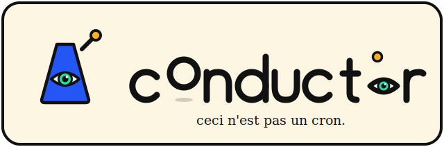

<p align="center">
  
</p>

<p align="center"><b>Put your Claude to work — on a schedule, on a budget, on your own machines.</b></p>

<p align="center">
  <a href="https://github.com/AnYejun/conductor/actions/workflows/ci.yml"></a>
  
  
</p>

Declare your tasks once — time window, cost budget, priority — and the runner
executes them automatically, *inside* the budget. Like cron, but the unit of
scheduling is dollars, not just clock time. Runs on the Claude API, on your
**Claude subscription** (headless Claude Code, no key), or across **your own
machines** as a tiny personal cloud.

```yaml
budget:
  daily_usd: 5.00

tasks:
  - id: morning-digest
    prompt_file: prompts/digest.md
    window: { earliest: "07:00", deadline: "09:00" }
    model: sonnet
    max_output_tokens: 2000
    on_budget_exceeded: downgrade   # opus → sonnet → haiku, automatically
```

```
$ conductor run
conductor · 3 tasks · budget: today $0.0000 / $5.00
07:00:12 running  morning-digest — model=sonnet
07:00:31 done     morning-digest — $0.0214 (est $0.0327) → .conductor/outputs/morning-digest-20260711-070031.md
```

## Why

Running Claude on a schedule is easy. Running it **without surprise bills** is not:

- Output cost is unknowable in advance — you only learn it after the response.
- Token counts are model-specific — the same prompt costs different amounts on
  different models, and OpenAI-tokenizer estimates (tiktoken) undercount Claude by 15–20%+.
- A fleet of scheduled tasks has no shared notion of "how much have we spent today?"

CONDUCTOR solves this with a three-step loop per task:

1. **Pre-flight** — `count_tokens` (free, exact, per-model) measures the input;
   `max_output_tokens` bounds the worst-case output. Together: a worst-case price tag.
2. **Gate** — worst-case cost is checked against the remaining daily/hourly budget
   (net of in-flight reservations, so concurrent tasks can't jointly overspend).
   Over budget → the task's policy decides: `downgrade` / `defer` / `skip`.
3. **Reconcile** — after the call, the *actual* cost from `response.usage`
   (including cache read/write tokens) is settled into a persistent ledger.

## Architecture

```
plan.yaml ─▶ [Loader/Schema] ─▶ [Scheduler loop] ─┬─▶ [Budget gate] ─▶ [Executor] ─▶ Claude API
                                                   │         ▲                │
                                              [Token estimator]          usage 회수
                                                   │         │                │
                                                   └────[Ledger/Log]◀─────────┘
```

| Component | File | Job |
|---|---|---|
| Schema/Loader | `schema.py` | pydantic-validated `plan.yaml` |
| Token estimator | `estimator.py` | `count_tokens` pre-flight + cost math |
| Budget ledger | `ledger.py` | persistent JSON spend log, daily/hourly windows, reservations |
| Scheduler | `scheduler.py` | asyncio loop: window ∈ now ∧ deps done ∧ budget OK → dispatch |
| Executor | `executor.py` | budget gate → `messages.create` → reconcile actual usage |
| Mesh hub | `hub.py` | work queue for your other machines (stdlib HTTP, long-poll) |
| Mesh worker | `worker.py` | runs on each device; executes shell/llm work, reports usage |
| Agent loop | `agent.py` | multi-step tool-use loop, budget-gated per turn |
| Tools | `tools.py` | read/write/edit/grep/bash + memory verbs (path-confined) |
| Memory | `memory.py` | LAPLAS-style long-term store: recall before, remember during |
| CLI | `cli.py` | `run` / `status` / `cost` / `hub` / `worker` / `nodes` / `memory` |

## Install

```bash
pip install -e .          # from a clone
export ANTHROPIC_API_KEY=sk-ant-...
```

## Quickstart

```bash
cp plan.example.yaml plan.yaml   # edit models/tasks/budget
conductor status                 # pre-flight: what would run, worst-case cost (free — uses count_tokens)
conductor run                    # scheduler loop until all tasks settle
conductor run --once             # single pass: run what's eligible right now, exit
conductor cost                   # what ran, when, and what it actually cost
```

Outputs land in `.conductor/outputs/<task>-<timestamp>.md`, spend in `.conductor/ledger.json`
(both next to your plan file).

## Mesh — use your own machines as a tiny cloud

Every device you own can be an execution node. One machine runs the **hub**
(a small work queue); every other device runs a **worker** that connects
*outbound* (long-poll) — so laptops and home machines behind NAT need **zero
port forwarding**. Tasks pick their node with one line: `runs_on: <name>`.

```
 plan.yaml (scheduler, budget)          hub (any reachable machine)
        │  runs_on: homebox   ─────────▶  work queue ◀──── long-poll ──── worker @ homebox
        │                                              ◀──── long-poll ──── worker @ macstudio
        └─ budget gate stays here;                     ◀──── long-poll ──── worker @ old-laptop
           workers report usage back → ledger
```

**Setup (once per device):**

```bash
# 1. on the hub machine (a tailnet/VPN address is the sane default)
export CONDUCTOR_TOKEN=$(openssl rand -hex 16)
conductor hub --host 100.64.0.3 --port 4747

# 2. on each device you want to lend
export CONDUCTOR_TOKEN=<same token>
conductor worker --hub http://100.64.0.3:4747 --node homebox --allow-shell

# 3. check who's connected (or open the "machines" tab in the app)
conductor nodes --hub http://100.64.0.3:4747
```

> **"Use my home computer from outside, with one Claude ID."** That's exactly
> what the mesh is — and it needs **no credential copying**. Run
> `claude /login` **once on each machine**; the mesh moves the *work* to the
> machine, not the login. From your laptop anywhere, schedule a `kind: claude`
> task with `runs_on: homebox` and it runs on the home machine under *its own*
> Claude session. The **machines** tab in the app shows which of your computers
> are online and gives you the exact join command. (There's no way to
> "auto-login" a fresh container — Claude auth is per-machine OAuth by design —
> and you don't need one: log in once per machine, dispatch forever.)

**Three kinds of remote work:**

```yaml
mesh: { hub: "http://100.64.0.3:4747" }

tasks:
  - id: backup                          # shell command on that machine
    kind: shell
    command: "tar czf /backups/docs.tgz ~/Documents"
    runs_on: homebox
    window: { earliest: "03:00" }

  - id: sandboxed-job                   # same, but isolated in a container
    kind: shell
    command: "python scrape.py"
    container: python:3.12-alpine       # wrapped in `docker run --rm`
    runs_on: homebox

  - id: remote-llm                      # Claude call from that machine's key,
    prompt_file: prompts/digest.md      # still gated + reconciled into YOUR ledger
    model: sonnet
    runs_on: macstudio
```

**Security model (read this):**

- Shell work is **remote code execution by design** — workers refuse it unless
  started with `--allow-shell`. A worker without the flag only does `llm` work.
- The hub refuses to bind a non-loopback address without `CONDUCTOR_TOKEN`
  (workers authenticate with it as a Bearer token).
- Run the hub on a tailnet/WireGuard address, not the open internet. The hub
  speaks plain HTTP; the VPN provides the encryption.
- `container:` gives per-task isolation on nodes that have docker.
- The budget never fragments: llm usage from any node reconciles into the
  scheduler's single ledger, so remote work draws from the same daily cap.

## Run on your Claude subscription (no API key)

Already paying for Claude Pro/Max? `kind: claude` runs the task through
**headless Claude Code** (`claude -p`) using the login session on that machine —
zero marginal USD cost, and the task gets the full Claude Code harness
(Read/Grep/Edit/Bash/WebSearch/...) as its toolset:

```yaml
tasks:
  - id: nightly-triage
    kind: claude                          # ← subscription executor
    claude_model: sonnet                  # alias passed to `claude --model`
    claude_tools: ["Read", "Grep", "Bash(git:*)"]   # --allowedTools, scoped
    workspace: ~/projects/myrepo
    prompt: "Triage today's TODO comments; summarize the 3 most urgent."
    window: { earliest: "02:00", deadline: "06:00" }
```

- **Auth**: whatever `claude /login` set up on that machine — your subscription.
  No `ANTHROPIC_API_KEY` anywhere.
- **Budget**: exempt from the USD gate (you already paid). The CLI-reported
  cost and token usage still land in the ledger at $0 for observability.
  Your plan's rate windows are the real constraint — see quota below.

### Quota-aware scheduling (the subscription budget gate)

Your plan's real limits are the **rolling 5-hour window** and the **weekly
window**. conductor estimates live burn the way the OSS ecosystem does
(ccusage-style): by aggregating the usage entries Claude Code writes to its
local transcripts, plus worker-reported usage from remote nodes. Give it
ceilings and the scheduler handles the rest:

```yaml
subscription:
  five_hour_tokens: 6000000     # burn units = in + out + cache-write tokens
  weekly_tokens: 300000000      # run `conductor quota` for a few days to calibrate
  reserve: 0.15                 # headroom kept for YOUR interactive use
```

When a window drops below the reserve, each `kind: claude` task's own
`on_budget_exceeded` policy decides:

- `defer` — wait; the scheduler retries **exactly when the window resets** (not blind polling)
- `downgrade` — step the model down (opus → sonnet → haiku) and run anyway
- `skip` — drop this run

`conductor quota` shows current burn, ceilings, and reset times. Unset
ceilings never gate — observe first, then calibrate.

### Dashboard

```bash
conductor ui        # → http://127.0.0.1:4748
```

A live, zero-dependency dashboard — not just observability, a control surface:

- **USD budget burndown** + **subscription quota gauges** with reset countdowns
- **Today's timeline** — every task's window as a 24h lane, with a now-line
- **Schedule a task from the browser** — the form writes to
  `.conductor/inbox.yaml` (your plan.yaml is never touched), and a running
  scheduler picks new tasks up live, no restart. Inbox tasks can be removed
  from the UI; plan-file tasks are read-only there.
- Recent runs and everything the agent has learned (long-term memory)

This is where "my agents worked while I slept" becomes visible.

Prefer a desktop app? Same dashboard, native window (WKWebView/WebView2 —
no Electron):

```bash
pip install "conductor-agent[app]"
conductor app                # native window
conductor app --scheduler    # + run the scheduler inside the app
```

Want a real double-clickable **Conductor.app** (embedded scheduler, custom
icon, DMG)? Build it locally:

```bash
pip install pyinstaller pywebview
./packaging/build_app.sh     # → dist/Conductor.app + dist/Conductor-<v>.dmg
```

First launch bootstraps `~/.conductor/plan.yaml` with a starter plan and runs
it — no terminal needed. `kind: claude` tasks use this machine's own
`claude /login` session (nested agent-session credentials are deliberately
stripped). Local ad-hoc signing only; distributing to others needs a
Developer ID + notarization.
- **Memory**: the recall briefing is injected via `--append-system-prompt`,
  and if the task has a write-capable tool, it's instructed to save lessons
  into the same `.conductor/memory/` store the built-in agent uses.
- **Mesh**: works remotely too — `runs_on: <node>` runs it on any machine
  where `claude` is installed and logged in. Workers treat `kind: claude`
  like shell work (full harness = shell-grade power): requires `--allow-shell`.

## Agentic tasks + long-term memory

A task can be a **single call** (default) or an **agent** (`agentic: true`) that
works in a tool-use loop until it's done — grounded in a persistent memory it
carries across runs.

```yaml
tasks:
  - id: audit-repo
    agentic: true
    tools: [read, grep, bash, remember, recall]   # opt into what it can touch
    workspace: ./src                               # file/bash tools confined here
    prompt: "Find the top 3 refactoring opportunities; remember each."
    model: sonnet
    max_steps: 15
    on_budget_exceeded: downgrade
```

**The loop** (`agent.py`): recall relevant memories → inject as a briefing →
`messages.create` ↔ execute tools → repeat until `end_turn`, `max_steps`, or the
**budget runs dry**. Every turn's real usage reconciles into the ledger *as it
goes*, so a runaway agent stops at the budget line, not after the bill.

**Tools** (`tools.py`) — opt in per task via `tools: [...]`:

| tool | what | default? |
|---|---|---|
| `read` / `grep` | inspect the workspace | ✅ safe default |
| `recall` / `remember` | search / save long-term memory | ✅ safe default |
| `write` / `edit` | modify files (path-confined to `workspace`) | opt-in |
| `bash` | run shell commands in `workspace` | opt-in (RCE — like `--allow-shell`) |

Omit `tools:` and the agent gets the safe read-only + memory set. File and bash
tools are confined to `workspace` (default: the plan directory) and refuse `..`
escapes. For untrusted work, pair with the mesh `container:` isolation.

**Long-term memory** (`memory.py`) — the LAPLAS-grade layer. Memories are plain
markdown files at `.conductor/memory/*.md`, one lesson each, with provenance
(which task wrote it). The agent `recall`s them before unfamiliar work and
`remember`s corrections and confirmed approaches as it learns — so the system
gets sharper every run instead of rediscovering the same things.

```bash
conductor memory                       # list everything the agent has learned
conductor memory -q "how is X wired"   # recall — same scorer the agent uses
```

Memories are human-readable and editable; delete a wrong one and it's gone. The
`recall()` method is the seam — point it at the LAPLAS MCP (`recall_compose`) to
upgrade flat recall into derivation-chain briefings.

## plan.yaml reference

```yaml
budget:
  daily_usd: 5.00       # hard ceiling, local calendar day
  hourly_usd: 1.00      # optional, rolling 60 minutes

models:
  # price = USD per 1M tokens. Fill with current rates:
  # https://platform.claude.com/docs/en/pricing  (validated: must be > 0)
  opus:   { id: claude-opus-4-8,  price_in: 5.00, price_out: 25.00 }
  sonnet: { id: claude-sonnet-5,  price_in: 3.00, price_out: 15.00 }
  haiku:  { id: claude-haiku-4-5, price_in: 1.00, price_out: 5.00 }

tasks:
  - id: my-task                      # unique
    kind: llm                        # llm (default, gated) | shell ($0) | claude (subscription)
    prompt_file: prompts/task.md     # llm: or inline `prompt: "..."`
    system: "You are ..."            # llm: optional system prompt
    model: sonnet                    # llm: key into `models`
    command: "make nightly"          # shell: the command to run
    container: python:3.12-alpine    # shell: optional docker isolation
    runs_on: homebox                 # optional mesh node; omit = run locally
    timeout_seconds: 600             # execution timeout (shell + remote wait)
    max_output_tokens: 2000          # llm: hard output cap = worst-case budget line
    priority: high                   # high | med | low (dispatch order within a tick)
    window:                          # optional; omit = run anytime
      earliest: "07:00"
      deadline: "09:00"              # past deadline while pending → expired
    depends_on: [other-task]         # runs only after deps succeed
    on_budget_exceeded: downgrade    # downgrade | defer | skip  (default: defer)
    agentic: true                    # llm: run a multi-step tool-use loop
    tools: [read, grep, bash]        # agentic: tools it may use (empty = safe default)
    workspace: ./src                 # agentic/claude: root for file/bash tools
    memory: true                     # agentic/claude: recall before + remember during
    max_steps: 15                    # agentic: loop iteration cap
    claude_model: sonnet             # claude: alias for `claude --model`
    claude_tools: ["Read", "Grep"]   # claude: --allowedTools (Claude Code tool names)
```

**Budget policies**

- `downgrade` — retry the gate on each strictly-cheaper model (by combined price),
  most expensive first. Each candidate is **re-estimated with its own tokenizer**.
- `defer` — stay pending, retry every tick until the deadline (then expire).
- `skip` — give up immediately.

## Accuracy notes (the part that's easy to get wrong)

- ✅ `count_tokens` is called with the **exact model id that will execute** —
  tokenizers differ across Claude models (Opus 4.7+ counts ~30% more than older ones).
- ✅ Never `tiktoken` — that's OpenAI's tokenizer.
- ✅ `count_tokens` is free with a separate rate limit → per-task pre-flight costs nothing.
- ✅ Estimates are estimates. The ledger records **actual** `response.usage`,
  including `cache_read_input_tokens` (~0.1× input rate) and
  `cache_creation_input_tokens` (~1.25×).
- ✅ Worst-case gating: output is unknowable in advance, so the gate assumes the
  full `max_output_tokens`. Reconciliation returns the unspent difference to the budget.

## Design decisions (v0.1)

- **Hybrid scheduling** — no fixed cron times; a task runs *within its window,
  when the budget allows*. Windows are local time-of-day, same-day (no overnight wrap yet).
- **Worst-case output estimation** — `max_output_tokens` as the budget line. Simple
  and safe; per-task historical averages would raise utilization but is future work.
- **Default policy: `defer`** — over-budget work waits rather than silently
  degrading or vanishing.
- **API-only executor** — headless `messages.create`. A Claude Code / agent-tool
  executor is on the roadmap.

## Roadmap

- [x] Compute mesh: hub + outbound-polling workers, `runs_on`, container isolation
- [x] Agentic tasks: tool-use loop (read/write/edit/grep/bash), budget-gated per turn
- [x] Long-term memory: recall-before / remember-during, provenance, `conductor memory`
- [x] Subscription executor: `kind: claude` via headless Claude Code (`claude -p`)
- [ ] Remote agentic (run the API agent loop on a mesh node; `kind: claude` already does)
- [ ] LAPLAS MCP memory backend (`recall_compose` derivation-chain briefings)
- [ ] DAG-aware topological scheduling (deps work today; ordering is per-tick greedy)
- [ ] Output-token estimation from per-task historical averages
- [ ] Budget-pressure optimizer: `(priority × value) / cost` knapsack
- [ ] Claude Code / Agent SDK executor for tool-using tasks
- [ ] MCP tool surface — let Claude schedule its own future work
- [x] Quota-aware scheduling: 5h + weekly subscription windows, auto defer/downgrade
- [x] Live web dashboard (`conductor ui`)

## License

MIT
